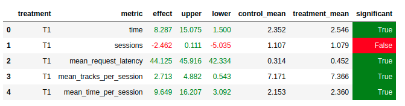

## Отчет

### Улучшим модель:

Возьмем за основу Context рекоммендер из 4 семинара. Только теперь обучим модель, которая кроме эмбеддингов контекста и треков выучивает еще эмбеддинги пользователей. Итоговое предсказание делается на основании рекомендаций для контекста, полученных как k ближайших соседей по текущему контексту. Данную логику можно улучшить или доработать, добавив например комбинацию с рекомендациями пользователей, однако в условиях повышенной загруженнолсти не хватило времени это реализовать

### Улучшим логику:

Пользователям могут надоедать некоторые треки или исполнители. Чтобы не рекомендовать их слишком часто, если фидбек от очередного трека ниже порога, патаемся положить трек и исполнителя в буфферы. Если буффер переполняется, выбрасываем треки этого исполнителя из истории рекомендаций, пока не найдем трек другого исполнителя, чтобы продолжить рекомендовать с него. В конце достаем рекомендации для трека, фильтруем на наличие в черном списке "надоевших" треков и исполнителей и возвращаем случайную рекомендацию

Всего при помощи AB экспериментов было подобрано три гиперпараметра:
- `time_threshold = 0.7` (порог фидбека, ниже которого трек и исполнитель считаются "приевшимися") 
- `artists_timeout = 1` (размер буфера "приевшихся" исполнителей), большее количество приводило к ухудшению рекомендаций
- `tracks_timeout = 30` (размер буфера "приевшихся" треков)



### Инструкция по запуску:

1. Создаем виртуальное окружение, следуем инструкциям в sim/README.md
2. Запускаем обучение модели в ноутбуке jupyter/Week4Seminar.ipynb
3. Указываем в botify/botify/config.json путь к полученным рекомендациям как параметр `TRACKS_CATALOG_B`
4. Поднимаем сервис рекомендаций botify из папки botify

```sudo docker-compose up -d --build```
5. Из виртуального окружения в папке sim запускаем поток пользователей

```PYTHONPATH=. python sim/run.py --episodes 2000 --recommender remote --config config/env.yml --seed 41```

6. Копируем логи в папку result

``` sudo docker cp recommender-container:/app/log/ ../result```

7. Смотрим результат AB эксперимента в ноутбуке jupyter/Week4Seminar.ipynb

### Идеи, которые не взлетели:
- Использовать не скалярное произведение, а косинусную близость как меру похожести
- Конкатенировать векторы context, track, user и прогонять через несколько линейных слоев с ReLU, в конце sigmoid
- Скалярное произведение конкатенированных эмбеддингов контекста и пользователя скалярно перемножаем с эмбеддингом трека  (его размерность в 2 раза больше)
- Использовать в качестве фоллбэка другие рекоменндеры
